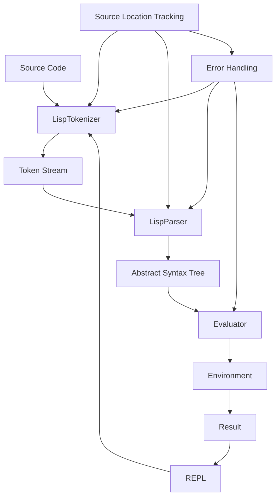
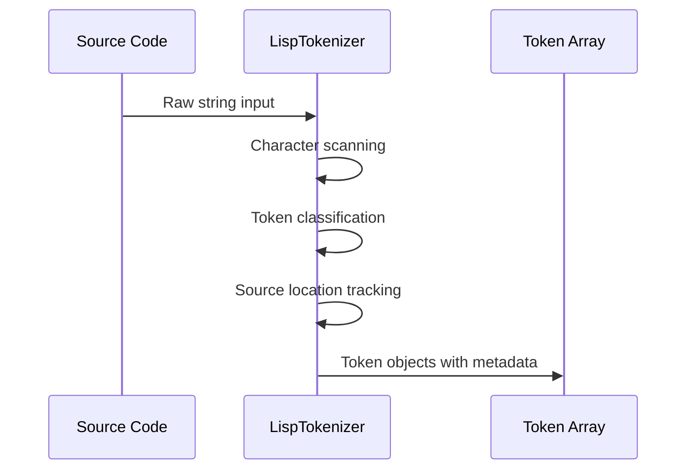
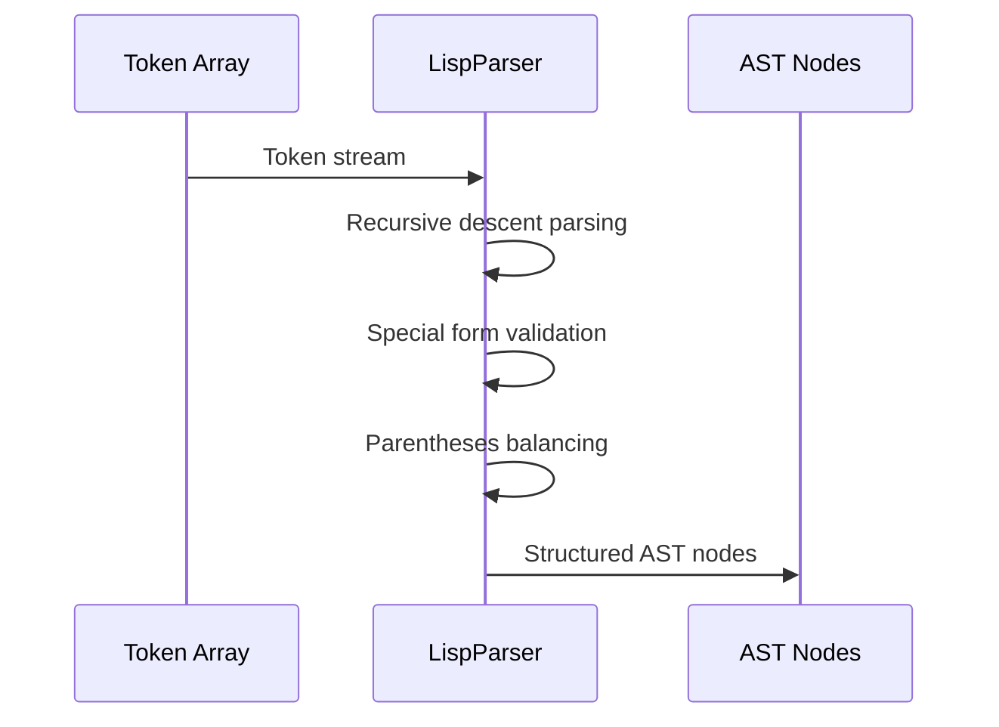
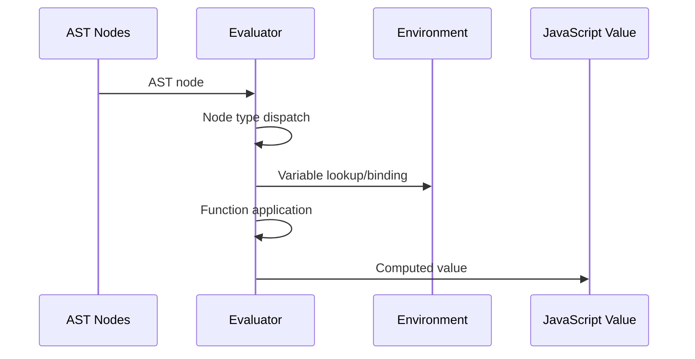
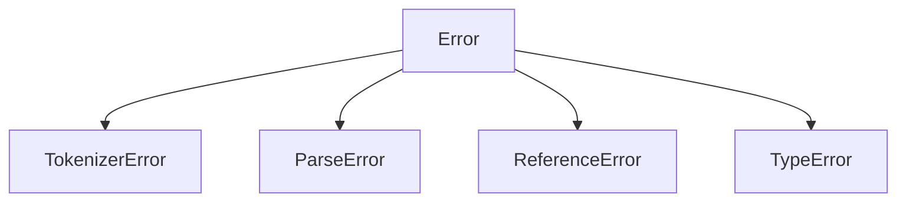

# Architecture Guide

This document provides a comprehensive overview of the Etherney Lisp Machine's architecture, design decisions, and component interactions.

## Table of Contents

- [Overview](#overview)
- [System Architecture](#system-architecture)
- [Component Details](#component-details)
- [Data Flow](#data-flow)
- [Design Patterns](#design-patterns)
- [Error Handling Strategy](#error-handling-strategy)
- [Performance Considerations](#performance-considerations)
- [Extension Points](#extension-points)

## Overview

The Etherney Lisp Machine follows a classic interpreter architecture with clear separation of concerns. The system is designed around the traditional phases of language processing:

1. **Lexical Analysis** (Tokenization)
2. **Syntax Analysis** (Parsing)
3. **Semantic Analysis** (Evaluation)

This modular approach ensures maintainability, testability, and extensibility.

## System Architecture



### Core Components

#### 1. Tokenizer ([`src/tokenizer.js`](../src/tokenizer.js))
- **Purpose**: Converts raw source code into a stream of tokens
- **Input**: String (Lisp source code)
- **Output**: Array of Token objects
- **Key Features**:
  - Character-by-character scanning
  - Source location tracking (line, column, position)
  - Comprehensive error reporting
  - Support for all Lisp data types

#### 2. Parser ([`src/parser.js`](../src/parser.js))
- **Purpose**: Builds Abstract Syntax Trees from token streams
- **Input**: Array of Token objects
- **Output**: Array of ASTNode objects
- **Key Features**:
  - Recursive descent parsing
  - Special form validation
  - Parentheses balancing
  - Source location preservation

#### 3. Evaluator ([`src/evaluator.js`](../src/evaluator.js))
- **Purpose**: Executes parsed expressions and returns results
- **Input**: ASTNode objects and Environment
- **Output**: JavaScript values
- **Key Features**:
  - Expression evaluation
  - Function application
  - Built-in function support

#### 4. Environment ([`src/environment.js`](../src/environment.js))
- **Purpose**: Manages variable bindings and scope
- **Input**: Variable names and values
- **Output**: Variable lookups and bindings
- **Key Features**:
  - Lexical scoping
  - Parent environment chaining
  - Variable definition and mutation

#### 5. REPL ([`src/repl.js`](../src/repl.js))
- **Purpose**: Provides interactive interface
- **Input**: User input from stdin
- **Output**: Evaluation results to stdout
- **Key Features**:
  - Interactive prompt
  - Error handling and display
  - Continuous evaluation loop

## Data Flow

### 1. Tokenization Phase



**Token Structure:**
```javascript
{
  type: 'NUMBER' | 'STRING' | 'SYMBOL' | 'LPAREN' | 'RPAREN' | 'QUOTE' | 'BOOLEAN' | 'EOF',
  value: any,
  line: number,
  column: number,
  position: number
}
```

### 2. Parsing Phase



**AST Node Structure:**
```javascript
{
  type: 'NUMBER' | 'STRING' | 'SYMBOL' | 'LIST' | 'QUOTE' | 'BOOLEAN',
  value: any,
  children: ASTNode[],
  sourceInfo: { line, column, position }
}
```

### 3. Evaluation Phase



## Design Patterns

### 1. Visitor Pattern (Evaluator)
The evaluator uses a visitor-like pattern to handle different AST node types:

```javascript
function evalNode(node, env) {
    switch (node.type) {
        case "NUMBER": return Number(node.value);
        case "STRING": return node.value;
        case "SYMBOL": return env.get(node.value);
        case "LIST": return evalList(node.children, env);
        case "QUOTE": return node.children[0];
        // ...
    }
}
```

### 2. Chain of Responsibility (Environment)
Environment lookup follows the chain of responsibility pattern:

```javascript
get(name) {
    if (this.vars.has(name)) return this.vars.get(name);
    if (this.parent) return this.parent.get(name);
    throw new ReferenceError(`Undefined variable ${name}`);
}
```

### 3. Factory Pattern (Token/AST Creation)
Consistent object creation through constructors:

```javascript
new Token(type, value, line, column, position)
new ASTNode(type, value, children, sourceInfo)
```

### 4. Strategy Pattern (Special Forms)
Different parsing strategies for special forms:

```javascript
validateSpecialForm(formName, children, sourceToken) {
    switch (formName) {
        case 'if': /* validation logic */
        case 'let': /* validation logic */
        case 'lambda': /* validation logic */
        // ...
    }
}
```

## Error Handling Strategy

### Error Hierarchy



### Error Information
All custom errors include:
- **Message**: Human-readable error description
- **Source Location**: Line, column, and position information
- **Context**: Token or AST node causing the error
- **Expected Values**: What was expected (for parse errors)

### Error Propagation
1. **Tokenizer Errors**: Caught and re-thrown as ParseError
2. **Parser Errors**: Include source location and context
3. **Runtime Errors**: Propagated to REPL for display

## Performance Considerations

### Memory Management
- **Token Reuse**: Tokens are created once and reused
- **AST Sharing**: Quoted expressions share AST nodes
- **Environment Chaining**: Efficient scope lookup through parent chains

### Time Complexity
- **Tokenization**: O(n) where n is source length
- **Parsing**: O(n) where n is number of tokens
- **Evaluation**: O(n) where n is number of AST nodes

### Optimization Opportunities
1. **Token Pooling**: Reuse token objects to reduce GC pressure
2. **AST Caching**: Cache parsed expressions for repeated evaluation
3. **Tail Call Optimization**: Implement proper tail calls for recursion
4. **Bytecode Compilation**: Compile to intermediate representation

## Extension Points

### 1. Adding New Data Types
To add a new data type:

1. **Tokenizer**: Add token type and recognition logic
2. **Parser**: Add parsing logic for the new type
3. **Evaluator**: Add evaluation logic
4. **Environment**: Add any special binding rules

### 2. Adding Built-in Functions
```javascript
// In createGlobalEnv()
env.define("new-function", (...args) => {
    // Implementation
    return result;
});
```

### 3. Adding Special Forms
1. **Parser**: Add to `specialForms` set and validation logic
2. **Evaluator**: Add special evaluation logic
3. **Documentation**: Update language reference

### 4. Custom Error Types
```javascript
class CustomError extends Error {
    constructor(message, sourceInfo) {
        super(message);
        this.name = 'CustomError';
        this.sourceInfo = sourceInfo;
    }
}
```

### 5. Alternative Interfaces
The modular design allows for alternative interfaces:
- **File-based interpreter**: Replace REPL with file processing
- **Web interface**: Use tokenizer/parser/evaluator in browser
- **Language server**: Implement LSP for editor integration

## Future Enhancements

### Planned Features
1. **Macro System**: Compile-time code transformation
2. **Module System**: Code organization and namespacing
3. **Garbage Collection**: Memory management for long-running programs
4. **Debugging Support**: Breakpoints and step-through debugging
5. **Standard Library**: Comprehensive built-in functions

### Architecture Evolution
1. **Bytecode VM**: Compile to intermediate representation
2. **JIT Compilation**: Just-in-time compilation for performance
3. **Concurrent Evaluation**: Support for parallel execution
4. **Type System**: Optional static typing support

This architecture provides a solid foundation for a complete Lisp implementation while maintaining flexibility for future enhancements and modifications.