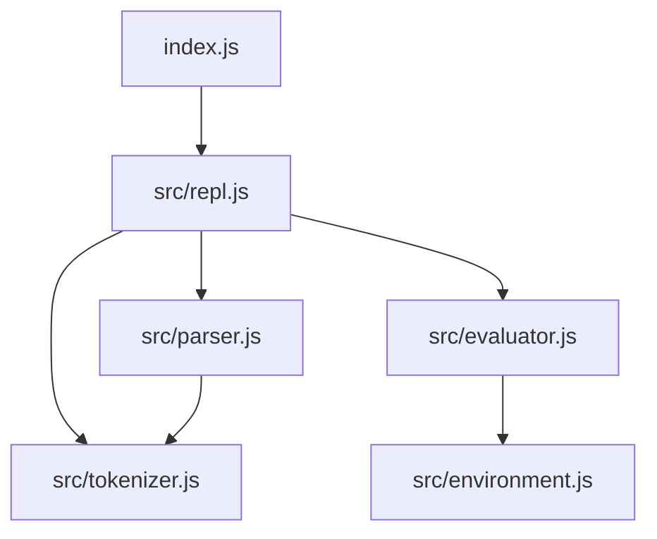

# Developer Guide

This guide provides comprehensive information for developers who want to contribute to, extend, or understand the internals of the Etherney Lisp Machine.

## Table of Contents

- [Getting Started](#getting-started)
- [Development Setup](#development-setup)
- [Code Organization](#code-organization)
- [Contributing Guidelines](#contributing-guidelines)
- [Extending the Interpreter](#extending-the-interpreter)
- [Testing Strategy](#testing-strategy)
- [Debugging Techniques](#debugging-techniques)
- [Performance Optimization](#performance-optimization)
- [Common Development Tasks](#common-development-tasks)

## Getting Started

### Prerequisites

- Node.js (version 12 or higher)
- Git
- Text editor or IDE with JavaScript support

### Development Setup

1. **Clone the repository**:
   ```bash
   git clone <repository-url>
   cd lispOS-e
   ```

2. **Install dependencies** (if any):
   ```bash
   npm install
   ```

3. **Run the interpreter**:
   ```bash
   node index.js
   ```

4. **Test your changes**:
   ```bash
   # Run basic tests
   node -e "
   const { LispTokenizer } = require('./src/tokenizer');
   const tokenizer = new LispTokenizer('(+ 1 2)');
   console.log(tokenizer.tokenize());
   "
   ```

## Code Organization

### Project Structure

```
lispOS-e/
├── index.js              # Entry point - starts REPL
├── src/                  # Core interpreter modules
│   ├── tokenizer.js      # Lexical analysis
│   ├── parser.js         # Syntax analysis  
│   ├── evaluator.js      # Expression evaluation
│   ├── environment.js    # Scope management
│   └── repl.js          # Interactive interface
├── docs/                 # Documentation
│   ├── ARCHITECTURE.md   # System design
│   ├── USER_GUIDE.md     # Language reference
│   ├── API_REFERENCE.md  # API documentation
│   ├── DEVELOPER_GUIDE.md # This file
│   └── EXAMPLES.md       # Code examples
└── README.md            # Project overview
```

### Module Dependencies



### Coding Standards

#### JavaScript Style Guide

1. **Use ES6+ features** where appropriate:
   ```javascript
   // Good
   const { LispTokenizer } = require('./tokenizer');
   const tokens = tokenizer.tokenize();
   
   // Avoid
   var LispTokenizer = require('./tokenizer').LispTokenizer;
   var tokens = tokenizer.tokenize();
   ```

2. **Consistent naming conventions**:
   - Classes: `PascalCase` (e.g., `LispTokenizer`)
   - Functions/methods: `camelCase` (e.g., `parseExpression`)
   - Constants: `UPPER_SNAKE_CASE` (e.g., `TOKEN_TYPES`)
   - Variables: `camelCase` (e.g., `currentToken`)

3. **Error handling**:
   ```javascript
   // Good - specific error types
   throw new TokenizerError('Invalid character', line, column, position);
   
   // Avoid - generic errors
   throw new Error('Something went wrong');
   ```

4. **Documentation**:
   ```javascript
   /**
    * Parse a single expression from the token stream
    * @returns {ASTNode|null} AST node or null if at end
    * @throws {ParseError} On invalid syntax
    */
   parseExpression() {
       // Implementation
   }
   ```

## Contributing Guidelines

### Before Contributing

1. **Read the documentation**: Understand the architecture and existing code
2. **Check existing issues**: Look for related work or discussions
3. **Start small**: Begin with bug fixes or small features
4. **Follow conventions**: Match existing code style and patterns

### Contribution Process

1. **Fork the repository**
2. **Create a feature branch**:
   ```bash
   git checkout -b feature/your-feature-name
   ```
3. **Make your changes**
4. **Test thoroughly**
5. **Commit with clear messages**:
   ```bash
   git commit -m "Add support for new data type: vectors"
   ```
6. **Submit a pull request**

### Code Review Checklist

- [ ] Code follows existing style conventions
- [ ] Changes are well-documented
- [ ] Error handling is appropriate
- [ ] No breaking changes to existing API
- [ ] Performance impact is considered
- [ ] Edge cases are handled

## Extending the Interpreter

### Adding New Data Types

To add a new data type (e.g., vectors), you need to modify multiple modules:

#### 1. Tokenizer Changes

Add token recognition in [`src/tokenizer.js`](../src/tokenizer.js):

```javascript
// In nextToken() method
case '[':
    return this.vector(startLine, startColumn, startPosition);

// Add new method
vector(startLine, startColumn, startPosition) {
    this.advance(); // Skip '['
    // Vector parsing logic
    return new Token('VECTOR_START', '[', startLine, startColumn, startPosition);
}
```

#### 2. Parser Changes

Add parsing logic in [`src/parser.js`](../src/parser.js):

```javascript
// In parseExpression() method
case 'VECTOR_START':
    return this.parseVector();

// Add new method
parseVector() {
    const startToken = this.advance(); // Consume '['
    const elements = [];
    
    while (!this.isAtEnd() && this.peek().type !== 'VECTOR_END') {
        elements.push(this.parseExpression());
    }
    
    // Expect ']'
    if (this.peek().type !== 'VECTOR_END') {
        throw new ParseError('Expected ]', this.peek());
    }
    this.advance(); // Consume ']'
    
    return new ASTNode('VECTOR', null, elements, startToken.sourceInfo);
}
```

#### 3. Evaluator Changes

Add evaluation logic in [`src/evaluator.js`](../src/evaluator.js):

```javascript
// In evalNode() function
case "VECTOR":
    return node.children.map(child => evalNode(child, env));
```

#### 4. Update Built-ins

Add vector-specific functions:

```javascript
// In createGlobalEnv()
env.define("vector", (...args) => args);
env.define("vector-ref", (vec, index) => vec[index]);
env.define("vector-length", (vec) => vec.length);
```

### Adding Built-in Functions

Add new built-in functions in [`src/evaluator.js`](../src/evaluator.js):

```javascript
// In createGlobalEnv()
env.define("string-length", (str) => {
    if (typeof str !== 'string') {
        throw new TypeError('string-length expects a string');
    }
    return str.length;
});

env.define("substring", (str, start, end) => {
    if (typeof str !== 'string') {
        throw new TypeError('substring expects a string');
    }
    return str.substring(start, end);
});
```

### Adding Special Forms

Special forms require parser validation and custom evaluation:

#### 1. Parser Validation

Add to [`src/parser.js`](../src/parser.js):

```javascript
// Add to specialForms set
this.specialForms = new Set([
    // ... existing forms
    'while', 'for', 'try-catch'
]);

// Add validation in validateSpecialForm()
case 'while':
    if (argCount !== 2) {
        throw new ParseError(
            `'while' requires exactly 2 arguments (condition and body), got ${argCount}`,
            sourceToken
        );
    }
    break;
```

#### 2. Evaluator Logic

Add special evaluation in [`src/evaluator.js`](../src/evaluator.js):

```javascript
function evalList(list, env) {
    if (list.length === 0) return null;

    const [first, ...rest] = list;
    
    // Handle special forms
    if (first.type === 'SYMBOL') {
        switch (first.value) {
            case 'while':
                return evalWhile(rest, env);
            case 'if':
                return evalIf(rest, env);
            // ... other special forms
        }
    }
    
    // Regular function application
    const fn = evalNode(first, env);
    if (typeof fn === "function") {
        const args = rest.map(arg => evalNode(arg, env));
        return fn(...args);
    }
    
    throw new Error("Not a function: " + JSON.stringify(first));
}

function evalWhile(args, env) {
    const [condition, body] = args;
    let result = null;
    
    while (evalNode(condition, env)) {
        result = evalNode(body, env);
    }
    
    return result;
}
```

### Adding Error Types

Create custom error types for better error handling:

```javascript
// In a new file or existing module
class RuntimeError extends Error {
    constructor(message, node) {
        super(message);
        this.name = 'RuntimeError';
        this.node = node;
        if (node && node.sourceInfo) {
            this.line = node.sourceInfo.line;
            this.column = node.sourceInfo.column;
        }
    }
}

class TypeMismatchError extends RuntimeError {
    constructor(expected, actual, node) {
        super(`Type mismatch: expected ${expected}, got ${actual}`, node);
        this.name = 'TypeMismatchError';
        this.expected = expected;
        this.actual = actual;
    }
}
```

## Testing Strategy

### Manual Testing

Use the REPL for interactive testing:

```lisp
elisp> (+ 1 2 3)
6
elisp> (print "Testing new feature")
Testing new feature
"Testing new feature"
```

### Automated Testing

Create test scripts:

```javascript
// test/tokenizer-test.js
const { LispTokenizer } = require('../src/tokenizer');

function testTokenizer() {
    const tests = [
        { input: '(+ 1 2)', expected: ['LPAREN', 'SYMBOL', 'NUMBER', 'NUMBER', 'RPAREN', 'EOF'] },
        { input: '"hello"', expected: ['STRING', 'EOF'] },
        { input: "'symbol", expected: ['QUOTE', 'SYMBOL', 'EOF'] }
    ];
    
    tests.forEach((test, i) => {
        const tokenizer = new LispTokenizer(test.input);
        const tokens = tokenizer.tokenize();
        const types = tokens.map(t => t.type);
        
        if (JSON.stringify(types) === JSON.stringify(test.expected)) {
            console.log(`✓ Test ${i + 1} passed`);
        } else {
            console.log(`✗ Test ${i + 1} failed`);
            console.log(`  Expected: ${test.expected}`);
            console.log(`  Got: ${types}`);
        }
    });
}

testTokenizer();
```

### Integration Testing

Test the complete pipeline:

```javascript
// test/integration-test.js
const { LispTokenizer } = require('../src/tokenizer');
const { LispParser } = require('../src/parser');
const { evalNode, createGlobalEnv } = require('../src/evaluator');

function testIntegration() {
    const tests = [
        { input: '(+ 1 2)', expected: 3 },
        { input: '(* 3 4)', expected: 12 },
        { input: '(print "hello")', expected: "hello" }
    ];
    
    const env = createGlobalEnv();
    
    tests.forEach((test, i) => {
        try {
            const tokenizer = new LispTokenizer(test.input);
            const tokens = tokenizer.tokenize();
            const parser = new LispParser('');
            parser.tokens = tokens;
            parser.current = 0;
            const ast = parser.parseExpression();
            const result = evalNode(ast, env);
            
            if (result === test.expected) {
                console.log(`✓ Integration test ${i + 1} passed`);
            } else {
                console.log(`✗ Integration test ${i + 1} failed`);
                console.log(`  Expected: ${test.expected}`);
                console.log(`  Got: ${result}`);
            }
        } catch (error) {
            console.log(`✗ Integration test ${i + 1} failed with error: ${error.message}`);
        }
    });
}

testIntegration();
```

## Debugging Techniques

### Debug Output

Add debug logging:

```javascript
// In tokenizer.js
nextToken() {
    if (process.env.DEBUG_TOKENIZER) {
        console.log(`Tokenizing at position ${this.position}: '${this.peek()}'`);
    }
    // ... rest of method
}

// Usage
DEBUG_TOKENIZER=1 node index.js
```

### AST Inspection

Use the parser's debug methods:

```javascript
const parser = new LispParser('(+ 1 2)');
const ast = parser.parse();
console.log(parser.getParseTree(ast));
```

### Step-by-step Evaluation

Add evaluation tracing:

```javascript
function evalNode(node, env) {
    if (process.env.DEBUG_EVAL) {
        console.log(`Evaluating: ${node.type}(${node.value})`);
    }
    
    switch (node.type) {
        // ... cases
    }
}
```

### Error Context

Enhance error messages with context:

```javascript
throw new ParseError(
    `Unexpected token: ${token.type} '${token.value}' at line ${token.line}:${token.column}\n` +
    `Context: ${this.getSourceContext(token)}`,
    token
);
```

## Performance Optimization

### Profiling

Use Node.js built-in profiler:

```bash
node --prof index.js
# Run some operations
node --prof-process isolate-*.log > profile.txt
```

### Memory Usage

Monitor memory usage:

```javascript
// Add to REPL or test scripts
setInterval(() => {
    const usage = process.memoryUsage();
    console.log(`Memory: ${Math.round(usage.heapUsed / 1024 / 1024)}MB`);
}, 1000);
```

### Optimization Strategies

1. **Token Pooling**: Reuse token objects
2. **AST Caching**: Cache parsed expressions
3. **Environment Optimization**: Use Maps for faster lookups
4. **Tail Call Optimization**: Implement proper tail calls

## Common Development Tasks

### Adding a New Operator

1. **Add to tokenizer** (if needed for special syntax)
2. **Add to evaluator**:
   ```javascript
   // In createGlobalEnv()
   env.define("mod", (a, b) => a % b);
   env.define("pow", (a, b) => Math.pow(a, b));
   ```

### Improving Error Messages

1. **Add source context**:
   ```javascript
   getSourceContext(token) {
       const lines = this.source.split('\n');
       const line = lines[token.line - 1];
       const pointer = ' '.repeat(token.column - 1) + '^';
       return `${line}\n${pointer}`;
   }
   ```

2. **Add suggestions**:
   ```javascript
   throw new ParseError(
       `Undefined variable '${name}'. Did you mean '${suggestion}'?`,
       token
   );
   ```

### Adding Language Features

1. **Research the feature** in other Lisp implementations
2. **Design the syntax** and semantics
3. **Implement incrementally**:
   - Tokenizer support
   - Parser support
   - Evaluator support
   - Built-in functions
   - Documentation
   - Tests

### Debugging Parser Issues

1. **Check token stream**:
   ```javascript
   const tokenizer = new LispTokenizer(source);
   const tokens = tokenizer.tokenize();
   console.log(tokens.map(t => `${t.type}(${t.value})`));
   ```

2. **Trace parsing**:
   ```javascript
   parseExpression() {
       console.log(`Parsing token: ${this.peek().type}(${this.peek().value})`);
       // ... rest of method
   }
   ```

3. **Validate AST structure**:
   ```javascript
   const ast = parser.parse();
   console.log(JSON.stringify(ast, null, 2));
   ```

This developer guide provides the foundation for contributing to and extending the Etherney Lisp Machine. For specific questions or advanced topics, refer to the other documentation files or examine the source code directly.